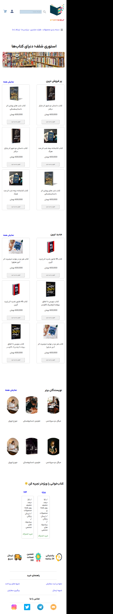
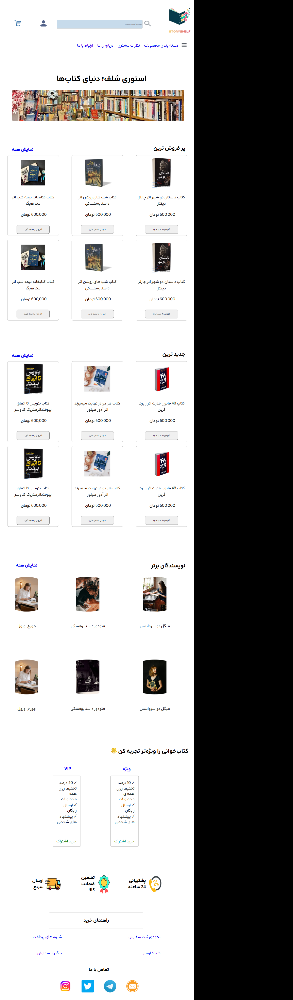
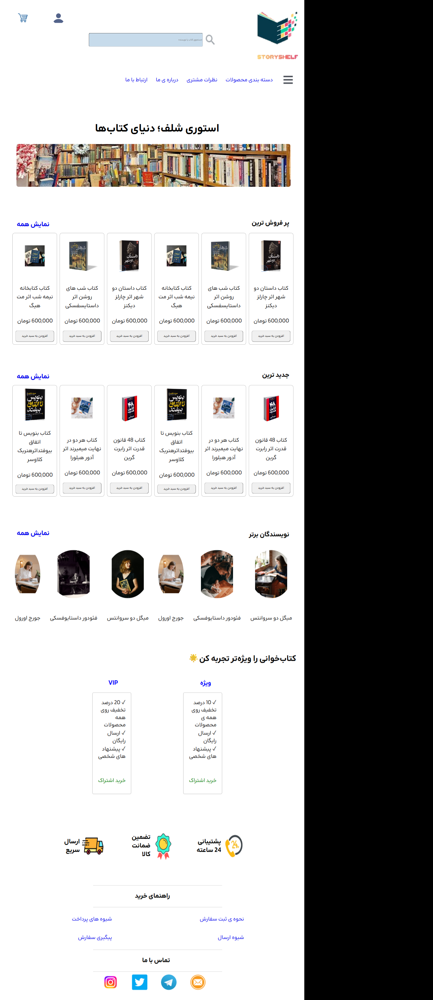

# Story Shelf

## About The Project

**Story Shelf** is a responsive bookstore website designed to provide users with a simple and enjoyable way to explore books and discover different sections of an online bookstore.

The project focuses on creating a clean user interface, improving the overall user experience, and building a responsive layout that works properly across different screen sizes.
---

## Features

* Responsive design for different screen sizes
* Mobile-first development approach
* Bookstore-themed user interface
* Navigation menu for easier access to different pages
* Book and product sections
* Customer reviews section
* About Us and Contact Us pages
* Structured and semantic HTML elements
---

## Technologies Used

This project was built using:

* **HTML5** – For creating the structure and content of the website
* **CSS3** – For styling and designing the user interface
* **Responsive Design** – For adapting the website to different screen sizes
* **Media Queries** – For improving the layout on tablets and larger screens
* **Flexbox** – For creating flexible and organized layouts
* **Git & GitHub** – For version control and project management

---

## What I Worked On

During this project, I focused on:

* Designing and developing a complete bookstore website
* Creating responsive layouts using a mobile-first approach
* Using semantic HTML elements to improve the structure of the website
* Managing spacing, sizing, and layouts with different CSS units
* Implementing responsive behavior with media queries
* Improving the visual appearance of the website using typography, borders, spacing, and images
* Organizing the project into multiple pages
* Practicing Git commands and managing project updates through GitHub

---

## Responsive Design

The website was developed with a **mobile-first approach**.

The initial layout was designed for smaller screens, and additional styles were added using media queries to improve the experience on tablets and larger screens.

The goal was to make the website usable and visually organized across different devices.

---

## Project Pages

The project includes several pages, such as:

* Home Page
* About Us
* Contact Us
* Customer Reviews
---

## AI Transparency

AI tools were used during the learning and problem-solving process.
The AI was mainly used to:
* Understand HTML, CSS, and responsive design concepts
* Learn how different CSS properties and layouts work
* Get explanations for programming errors and problems
* Explore possible solutions and approaches to technical challenges
* Better understand concepts such as Flexbox, CSS units, media queries, and responsive design

**AI was not used to directly generate the project code.**
The code was written and implemented by me based on my own understanding and learning process. AI assistance was primarily used for explanations, concepts, debugging guidance, and understanding possible solutions rather than requesting ready-to-copy code.

---
## What I Learned

Through this project, I improved my understanding of:
* HTML structure and semantic elements
* CSS styling
* Responsive Design
* Mobile-first development
* Media Queries
* Flexbox
* CSS sizing units
* Git and GitHub
---

##Preview for Mobile Device:

---

##Preview for Tablet Device:

---

##Preview for Tablet Device:

---

## Live Demo

You can view the live version of the project here:

(https://np81706831.github.io/My-Task/)

---
## Author

Created and developed by **Narges Pourhashemi**.
